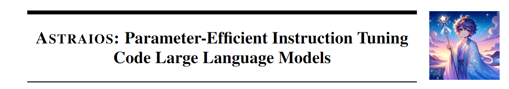

# Astraios: Parameter-Efficient Instruction Tuning Code Language Models

<p align="center" width="100%">
<a ></a>
</p>

This repository provides an overview of all components from the paper [Astraios: Parameter-Efficient Instruction Tuning Code Large Language Models]().

<!-- TOC -->

- [Overview](#overview)
- [PEFT](#peft)
- [Evaluation](#evaluation)
- [Training](#training)
- [Outputs](#outputs)
- [Visuals](#visuals)
- [Licenses](#licenses)
- [Citation](#citation)

<!-- /TOC -->

## Overview

<table>
<tr>
<th>Data</t> 
<td><a href=https://huggingface.co/datasets/bigcode/guanaco-commits>CommitPackFT+OASST</a></td>
<td>Filtered version of CommitPack and OASST for high-quality commit messages that resemble instructions</td>
</tr>
<tr>
<th>Model</t> 
<td><a href=https://huggingface.co/collections/bigcode/astraios-1b-6576ff1b8e449026ae327c1c>Astraios-1B</a></td>
<td>Collection of StarCoderBase-1B models instruction tuned on CommitPackFT + OASST with different tuning methods</td>
</tr>
<tr>
<th></t> 
<td><a href=https://huggingface.co/collections/bigcode/astraios-3b-6577127317ee44ff547252d3>Astraios-3B</a></td>
<td>Collection of StarCoderBase-3B (3B parameters) models instruction tuned on CommitPackFT + OASST with different tuning methods</td>
</tr>
<tr>
<th></t> 
<td><a href=https://huggingface.co/collections/starpeft/starcoderbase-7b-650c1f028b45cfec8e72c265>Astraios-7B</a></td>
<td>Collection of StarCoderBase-7B (7B parameters) models instruction tuned on CommitPackFT + OASST with different tuning methods</td>
</tr>
<tr>
<th></t> 
<td><a href=https://huggingface.co/collections/bigcode/astraios-16b-65788b7476b6de79781054cc>Astraios-16B</a></td>
<td>Collection of StarCoderBase-16B (16B parameters) models instruction tuned on CommitPackFT + OASST with different tuning methods</td>
</tr>
<tr>
<th>Evaluation</t> 
<td><a href=https://huggingface.co/datasets/code_x_glue_cc_clone_detection_big_clone_bench>BigCloneBench</a></td>
<td>Dataset for clone detection; We use 2,000 samples for evaluation</td>
</tr>
<tr>
<th></t> 
<td><a href=https://huggingface.co/datasets/code_x_glue_cc_defect_detection>Devign</a></td>
<td>Dataset for defect detection; We use 2,000 samples for evaluation</td>
</tr>
<tr>
<th></t> 
<td><a href=https://huggingface.co/datasets/bigcode/humanevalpack>HumanEvalPack</a></td>
<td>Extension of OpenAI's HumanEval to cover 3 scenarios across 6 languages</td>
</tr>
<tr>
<th></t> 
<td><a href=https://huggingface.co/datasets/RaymondLi/perturbed_humaneval>ReCode</a></td>
<td>Dataset for the robustness of code generation, covering 4 variants</td>
</tr>
<tr>
<th></t> 
<td><a href=https://huggingface.co/datasets/moyix/asleep_keyboard>Asleep At The Keyboard</a></td>
<td>Datasets for security of code generation; We use DoW for evaluation</td>
</tr>
</table>

## PEFT

**Setup:** Run the bash code below to set up the PEFT methods used in our work. We additionally implement `AdapterH`, `AdapterP` and `Parallel` methods based on the `peft==0.6.0.dev0`. For more information, please refer to the [peft folder](peft/).

```bash
pip install git+https://github.com/bigcode-project/astraios#subdirectory=peft
```

Notes:

- As `Prefix Tuning` does not work for StarCoder training, we do not evaluate this method. 
- For any configuration issues, please refer to the original [PEFT](https://github.com/huggingface/peft).

## Evaluation

1. **Setup:** Run the bash code below to set up the evaluation repository.

```bash
git clone -b astraios https://github.com/bigcode-project/bigcode-evaluation-harness
cd bigcode-evaluation-harness
pip install -q -r requirements.txt
accelerate config
```

2. **Run:** All evaluation scripts are in [evaluation folder](evaluation/). Run each script via bash.

We use `astraios-1b-lora` as an example and use the bash code to run the following tasks:

- Clone Detection
```bash
accelerate launch main.py \
--model bigcode/starcoderbase-1b  \
--peft_model bigcode/astraios-1b-lora \
--tasks clone_detection \
--do_sample False \
--batch_size 1 \
--save_generations \
--trust_remote_code \
--save_generations_path generations_clone_detection_astraios-1b-lora.json \
--max_length_generation 512
```

- Defect Detection
```bash
accelerate launch main.py \
--model bigcode/starcoderbase-1b  \
--peft_model bigcode/astraios-1b-lora \
--tasks clone_detection \
--do_sample False \
--batch_size 1 \
--save_generations \
--trust_remote_code \
--save_generations_path generations_defect_detection_astraios-1b-lora.json \
--max_length_generation 512
```

- HumanEvalSynthesize-Python
```bash
accelerate launch main.py \
--model bigcode/starcoderbase-1b  \
--peft_model bigcode/astraios-1b-lora \
--tasks humanevalsynthesize-python \
--do_sample True \
--temperature 0.2 \
--n_samples 20 \
--batch_size 5 \
--allow_code_execution \
--save_generations \
--trust_remote_code \
--prompt octocoder \
--save_generations_path generations_humanevalsynthesizepython_astraios-1b-lora.json \
--metric_output_path evaluation_humanevalsynthesizepython_astraios-1b-lora.json \
--max_length_generation 2048
```

- HumanEvalFix-Python
```bash
accelerate launch main.py \
--model bigcode/starcoderbase-1b  \
--peft_model bigcode/astraios-1b-lora \
--tasks humanevalfixtests-python \
--do_sample True \
--temperature 0.2 \
--n_samples 20 \
--batch_size 1 \
--allow_code_execution \
--save_generations \
--trust_remote_code \
--prompt octocoder \
--save_generations_path generations_humanevalfixpython_astraios-1b-lora.json \
--metric_output_path evaluation_humanevalfixpython_astraios-1b-lora.json \
--max_length_generation 2048
```

- HumanEvalExplain-Python
```bash
accelerate launch main.py \
--model bigcode/starcoderbase-1b \
--peft_model bigcode/astraios-1b-lora \
--tasks humanevalexplaindescribe-python \
--generation_only \
--do_sample True \
--temperature 0.2 \
--n_samples 20 \
--batch_size 5 \
--allow_code_execution \
--save_generations \
--trust_remote_code \
--prompt octocoder \
--save_generations_path generations_humanevalexplaindescribe-python_astraios-1b-lora.json \
--max_length_generation 2048 

accelerate launch main.py \
--model bigcode/starcoderbase-1b  \
--peft_model bigcode/astraios-1b-lora \
--tasks humanevalexplainsynthesize-python \
--do_sample True \
--temperature 0.2 \
--n_samples 1 \
--batch_size 1 \
--allow_code_execution \
--save_generations \
--trust_remote_code \
--prompt octocoder \
--load_data_path generations_humanevalexplainsynthesize-python_astraios-1b-lora.json \
--save_generations_path generations_humanevalexplainsynthesize-python_astraios-1b-lora.json \
--metric_output_path evaluation_humanevalexplainpython_astraios-1b-lora.json \
--max_length_generation 2048
```

- ReCode-Format
```bash
accelerate launch main.py \
--model bigcode/starcoderbase-1b  \
--peft_model bigcode/astraios-1b-lora \
--tasks perturbed-humaneval-format-num_seeds_5 \
--do_sample False \
--batch_size 1 \
--allow_code_execution \
--save_generations \
--trust_remote_code \
--n_samples 1 \
--batch_size 1 \
--allow_code_execution \
--save_generations \
--trust_remote_code \
--prompt octocoder \
--save_generations_path generations_perturbed-humaneval-format-num_seeds_5_astraios-1b-lora.json \
--metric_output_path evaluation_perturbed-humaneval-format-num_seeds_5_astraios-1b-lora.json \
--max_length_generation 1024
```

- AATK-DoW
```bash
accelerate launch main.py \
--model bigcode/starcoderbase-1b  \
--peft_model bigcode/astraios-1b-lora \
--tasks asleep_completion \
--do_sample True \
--temperature 0.2 \
--n_samples 20 \
--batch_size 1 \
--generation_only \
--save_generations \
--trust_remote_code \
--prompt octocoder \
--save_generations_path generations_asleep_completion_astraios-1b-lora.json \
--metric_output_path evaluation_asleep_completion_astraios-1b-lora.json \
--max_length_generation 1024
```

Note:
- When evaluating FFT models, `--peft_model` should be removed and FFT model names need to pass with `--model`, e.g.:
```bash
accelerate launch main.py \
--model bigcode/astraios-1b-fft  \
--tasks clone_detection \
--do_sample False \
--batch_size 1 \
--save_generations \
--trust_remote_code \
--save_generations_path generations_clone_detection_astraios-1b-fft.json \
--max_length_generation 512
```
- The evaluation notebook for Clone Detection and Defection is stored in [evaluation/eval_code_comprehension.ipynb](evaluation/eval_code_comprehension.ipynb).

## Training

### PEFT

The finetuning python script is at `finetune.py`. Coresponding PEFT configurations are stored in `peft_config.py`.
To train all models with PEFT, run the bash code:
```bash
sh run_peft.sh
```

Note:
- `--gradient_accumulation_steps 32` is for a single GPU. If the model is trained with 8 GPUs, `gradient_accumulation_steps` should be adjusted to `4`.

### FFT

To train all models with FFT, run the bash code:
```bash
sh run_fft.sh
```

Note:
- `--gradient_accumulation_steps 32` is for a single GPU. If the model is trained with 8 GPUs, `gradient_accumulation_steps` should be adjusted to `4`.

## Outputs

Outputs are under their corresponding subfolders in [outputs folder](outputs/).

Note:
- Some outputs may be missing as they were not saved initially.

## Visuals

Figures:

- All figures are created via [this colab notebook](https://colab.research.google.com/drive/1EVClM38KBpdZkL7ELYCrPkS2YmObM3SV?usp=sharing).

- The figure of Astraios is generated via [DALL-E](https://openai.com/dall-e-3) with the prompt of `A fantasy-inspired, adorable illustration of Astraios, the Greek god of dusk. The setting is a serene evening landscape with a gradient sky transition`.

## Licenses

Everything is licensed as permissively as possible to us. 

The evaluation repository `Code Generation LM Evaluation Harness` is licensed under the [Apache-2.0 license](https://github.com/bigcode-project/bigcode-evaluation-harness/blob/main/LICENSE).

[PEFT library](https://github.com/huggingface/peft) is licensed under [Apache-2.0 license](https://github.com/bigcode-project/bigcode-evaluation-harness/blob/main/LICENSE).

All Astraios models are licensed under the [same license as StarCoder](https://huggingface.co/spaces/bigcode/bigcode-model-license-agreement) (Commercial except for use cases deemed harmful).

The remaining code originally created in this repository is licensed under the MIT License.

## Todo List

- [ ] Organize the file names in `outputs/` folder. 
- [ ] Organize the bash script in `evaluation/` folder.
- [ ] Add bibtex for citation.
- [ ] Merge the PR to `bigcode-evaluation-harness`.

## Citation

```bibtex

```
